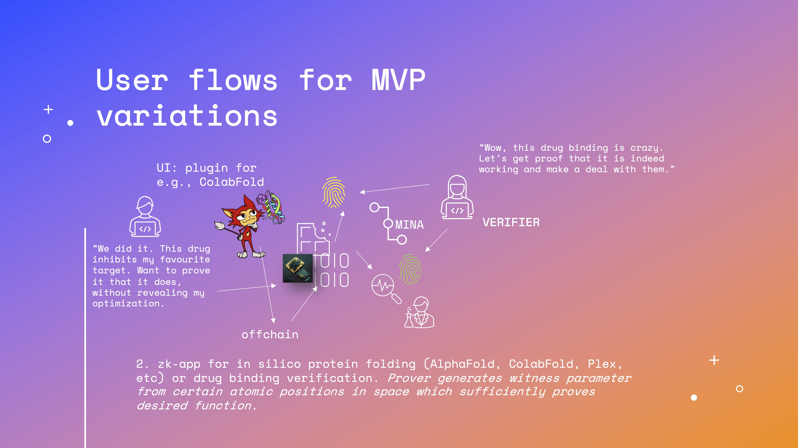

### **Architecture**

After feedback and discussions, we envision 3+1 possibilities for the architecture, which are use case specific for the MVPs. These 3+1 options cover most of the aspects where pipeline proving is beneficial for biopharma, academia and DAOs as well. As MINA's Kimchi allows batch proofing, sequential and pipeline-like applications are perfect candidates to start development.

1. zk-app for cloud laboratory (e.g. Emerald Cloud Labs, Strateos) experiment pipeline execution verification. Prover generates witness parameter from runtime execution(s) yielding to specific result. Use of Cartesi machine, RISC0 could be considered.

1. zk-app for in silico protein folding (AlphaFold, ColabFold, Plex, etc) or drug binding verification. Prover generates witness parameter from certain atomic positions in space which sufficiently proves desired function.

1. zk-app modular architecture for "BioSNARKs as a Service" "BioSNaaS" or similar (for pharma-DAO-academy interactions). Combination of different BioSNARK approaches with purpose specific circuit generation.
    
    
    

The +1 is a lightweight investigation about possibility to integrate BioSNARKs or "BioSNARKing" to Molecule's IP-NFT protocol, to effectively yield/mint ZK-IP-NFTs.

These apps would likely run from browser, or as background processes of lab computers and/or hardware. The user could select which processes to verify (e.g. whole pipeline or result only).

In terms of the zk-App, an early decision would be to ask on what level of physical or digital evidence should the proof be based on. Traditional zero-knowledge proof involves a binary relation R and an input x. A prover shows and convinces a verifier that there exists a witness w such that (x, w) ∈ R. The verifier should be not learn anything from the protocol, except the existence of w. Fisch et al, and others have proposed different approaches for Physical (biological) ZK properties. As for an early implementation, hybrid type of application could be beneficial. The BioSNARKS zk-app could be developed in a way that could interact on machine bit level or with metadata, also gathering e.g. system state snapshots for further verification. Also, an use of an hardware-key type of device is not out of question if the solution would gain widespread popularity. If needed, interaction with analog or old, but complex electronic lab equipment, external hardware keys, possibly equipped with a sensor could be considered. As R&D work is heavily moving into in-silico and cloud computing approaches, where wetlab validation of the hypothesis is rapidly tested within part of the same pipeline, we do not see legacy instruments a major risk for widespread implementation, but concerns are expressed at the Risk section of the proposal.
